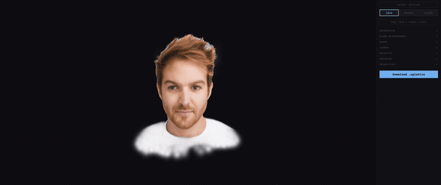

<div align="center">


# splattie-widget

**Interactive 3D Gaussian Splatting - like Rive/Lottie for 3D**

[](https://www.npmjs.com/package/@afromero/splattie-widget)
[](LICENSE)
[](https://typescriptlang.org)
[](https://github.com/sparkjsdev/spark)
[](https://threejs.org)
[]()
[]()

[Quick Start](#quick-start) · [Format Spec](#the-splattie-format) · [API](#api) · [Editor](#visual-editor) · [How It Works](#how-it-works)

</div>

---

<p align="center">
  
</p>

A web component that makes gaussian splats **reactive**. One file, one tag. Eyes follow the cursor, face blinks and reacts to hover/click, expressions transition smoothly. 60fps, client-side.

**[See it live at afromero.co](https://afromero.co)** | **[Create your own at splattie.app](https://splattie.app)**

## Quick Start

```html
<splattie-widget src="avatar.splattie"></splattie-widget>
<script type="module" src="https://unpkg.com/@afromero/splattie-widget"></script>
```

Or via npm:

```bash
npm install @afromero/splattie-widget
```

```typescript
import '@afromero/splattie-widget';
```

## The `.splattie` Format

> **v0.x experimental.** Core files (PLY, FLAME bones) follow established standards. Expression basis and states may evolve.

A ZIP bundle. Only the splat data is required - everything else adds features incrementally.

```
avatar.splattie
├── *.ply or *.spz            # (required) Gaussian splats
├── bone_tree.json            # (optional) Skeleton for skinning
├── lbs_weight_20k.json       # (optional) Per-splat bone weights
├── expression_basis.bin      # (optional) Blendshape basis
└── states.json               # (optional) Interaction states
```

<details>
<summary><strong>Splat data</strong> (<code>.ply</code> or <code>.spz</code>) - standard 3DGS format</summary>

Each splat has position, scale, rotation, opacity, and SH color. Auto-detected from file header. Works with any 3DGS method (LAM, DreamGaussian, InstantSplat, etc.). Standard format, unlikely to change.
</details>

<details>
<summary><strong>bone_tree.json</strong> - skeleton hierarchy</summary>

5 FLAME bones: root > neck > jaw, leftEye, rightEye. Used for SplatSkinning (dual quaternion).

```json
{
  "bones": [{
    "name": "root",
    "position": [x, y, z],
    "children": [{
      "name": "neck",
      "position": [x, y, z],
      "children": [
        { "name": "jaw", "position": [x, y, z] },
        { "name": "leftEye", "position": [x, y, z] },
        { "name": "rightEye", "position": [x, y, z] }
      ]
    }]
  }]
}
```

Stable structure. Bone names are conventions, not hard requirements. Without it: no eye tracking, no jaw animation.
</details>

<details>
<summary><strong>lbs_weight_20k.json</strong> - per-splat bone weights</summary>

2D array `[num_splats][num_bones]`, each row sums to ~1.0. Widget selects top 4 per splat.

```json
[[0.8, 0.1, 0.05, 0.03, 0.02], ...]
```

Standard LBS format from FLAME. Without it: bones exist but nothing moves.
</details>

<details>
<summary><strong>expression_basis.bin</strong> - FLAME blendshape basis</summary>

Per-splat position displacements for each expression coefficient. Moves all splats coherently for smile, lip shapes, etc.

```
Header: "EXPR" (4B) + num_vertices (u32 LE) + num_expressions (u32 LE)
Data:   float32 LE array, shape (num_vertices, num_expressions, 3)
```

Optional sidecar `expression_basis.json` with semantic labels:
```json
{ "labels": ["jawDown", "lipsUp", "lipsL", ...], "num_expressions": 50 }
```

Experimental format, may add compression. Without it: bone-driven expressions still work.
</details>

<details>
<summary><strong>states.json</strong> - interaction state definitions</summary>

Each state (idle, hover, click) sets all 5 dimensions simultaneously.

```json
{
  "version": 1,
  "defaults": {
    "camera": { "theta": 0, "phi": 75, "radius": 0.5, "fov": 60 },
    "autoBlink": { "interval": [2000, 7000], "duration": 150 }
  },
  "states": {
    "idle": {
      "ghost": { "amplitude": 0.003, "frequency": 0.4, "wobble": 0.2 },
      "expression": { "jawOpen": 0, "smile": 0 },
      "camera": { "theta": 0, "phi": 75, "radius": 0.5, "fov": 60 },
      "rotation": [0, 0, 0],
      "tracking": { "eyes": 1.0, "head": 0.1 }
    },
    "hover": { "..." : "..." },
    "click": { "..." : "..." }
  },
  "transitions": {
    "idle->hover": { "duration": 0.3, "easing": "ease-out" },
    "*->click": { "duration": 0.1, "easing": "snap" }
  }
}
```

Most likely to evolve. Without it: sensible defaults (eyes track, gentle float, auto-blink).
</details>

### Creating Your Own

**Visual editor**: `npm run dev`, adjust sliders, click "Download .splattie".

**From scratch**: ZIP a `.ply` with any combination of the optional files.

**From a photo**: run [LAM](https://github.com/aigc3d/LAM) on a GPU, then bundle with the export script. See the [full pipeline](https://github.com/affromero/splattie).

## Five Dimensions of State

| Dimension | Controls | Example |
|-----------|----------|---------|
| **Ghost** | Floating/bobbing | Gentle hover on idle, freeze on click |
| **Expression** | FLAME blendshapes + bones | Smile on hover, surprise on click |
| **Camera** | Spherical position | Zoom in on hover |
| **Rotation** | Pitch/yaw/roll | Tilt head on hover |
| **Tracking** | Cursor-follow intensity | Eyes on idle, head follows on hover |

Interpolated between states with configurable easing and duration.

<details>
<summary><strong>Expression system details</strong></summary>

Two layers:

**Bone-driven** (SplatSkinning, 5 FLAME bones):
- Jaw open/close, neck pitch/yaw/roll
- Eye gaze direction (left/right, up/down)
- Brow raise/frown (left/right independently)

**Blendshape-driven** (FLAME expression basis, 10+ PCA coefficients):
- Moves all 20K splats coherently
- Smile, lip shapes, jaw articulation, cheek/nose deformation
- Spatial mask prevents beard/neck from deforming
</details>

## API

| Attribute | Description |
|-----------|-------------|
| `src` | URL to `.splattie` file (or `.ply`/`.spz`) |
| `background` | Background color hex (default: `#0e0e14`) |
| `width` | CSS width (default: `100%`) |
| `height` | CSS height (default: `400px`) |

```javascript
widget.addEventListener('splatload', () => {});   // ready
widget.addEventListener('splathover', () => {});   // cursor on face
widget.addEventListener('splatclick', () => {});   // clicked face
widget.addEventListener('splatleave', () => {});   // cursor left
widget.setState('hover');                           // force transition
```

## Visual Editor

```bash
npm run dev  # http://localhost:4002
```

Sliders for all 5 dimensions, camera sphere widget, state tabs with copy-forward, FLAME blendshape controls, drag-and-drop `.splattie` upload, export when done.

## How It Works

Built on [Spark 2.0](https://github.com/sparkjsdev/spark) (MIT, World Labs).

<details>
<summary><strong>Architecture</strong></summary>

1. **State machine** with per-dimension interpolation (lerp, slerp, ease curves)
2. **SplatSkinning** (dual quaternion) driving 5 FLAME bones from expression + cursor data
3. **Expression basis** - per-splat position offsets written to Spark's packed buffer (half-float, ~20K splats/frame)
4. **Hit detection** via `readPixels` after render (pixel-perfect)
5. **Auto-blink** with randomized interval and sine-curve via SplatEdit
6. **Gyroscope** tracking on mobile (iOS permission prompt included)
</details>

## Mobile

Touch + gyroscope. Eyes follow device orientation on mobile, touch position on tap. Return to center when finger lifts. iOS motion permission requested automatically.

## Browser Support

Chrome, Firefox, Safari, Edge. WebGL 2 required. No COOP/COEP headers needed.

## Acknowledgements

- [LAM](https://github.com/aigc3d/LAM) (SIGGRAPH 2025) - Zixuan Zeng et al., AIGC3D team
- [FLAME](https://flame.is.tue.mpg.de/) - Tianye Li, Timo Bolkart, Michael J. Black, Hao Li, Javier Romero
- [Spark 2.0](https://github.com/sparkjsdev/spark) - World Labs (MIT)
- [3D Gaussian Splatting](https://repo-sam.inria.fr/fungraph/3d-gaussian-splatting/) - Kerbl, Kopanas, Leimkuhler, Drettakis (INRIA)

## License

MIT
